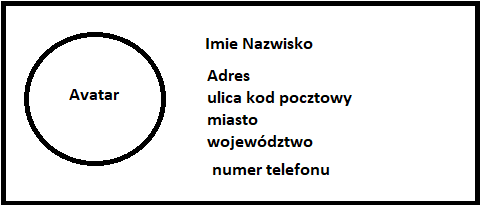

# Zadania komponenty

## Zadanie 1

Stwórz komponent o nazwie Card, który wyświetli osobę w wirtualnej książce telefonicznej lokalnej firmy transportowej. Sugeruj się szkicem ze zdjęcia poniżej, ma to jedynie obrazować rozłożenie elementów na stronie. Stylowanie pozostawiam Twojej inwencji twórczej.<br/>


## Zadanie 2

Rozbuduj komponent Card z poprzedniego zadania, aby można do niego było przekazywać propsy takie jak link do zdjęcia, imie, nazwisko, ulica, kod pocztowy, miasto, województwo i numer telefonu, a następnie przekaż do niego dane z obiektu zdefiniowanego poniżej.

```js
const singleData = {
  imgSrc:
    "https://images.unsplash.com/photo-1661869535393-872dea2d9f8d?ixlib=rb-1.2.1&ixid=MnwxMjA3fDB8MHxwaG90by1wYWdlfHx8fGVufDB8fHx8&auto=format&fit=crop&w=1887&q=80",
  name: "Adam",
  surname: "Jochemczyk",
  street: "TestStreet",
  postCode: "00-123",
  town: "Town",
  subRegion: "Region",
  phoneNumber: "+48 123 456 789",
};
```

## Zadanie 3

Stwórz komponent Wrapper, który będzie odpowiedzialny za rozmieszczenie wielu komponentów Card na stronie w zależności od wielkości ekranu. Na desktopie rozmieść komponenty Card obok siebie, a na mniejszych ekranach jeden pod drugim. Wykorzystaj mapowanie i tablicę obiektów zdefiniowaną niżej

```js
const cards = [
  {
    id: 1,
    imgSrc:
      "https://images.unsplash.com/photo-1661869535393-872dea2d9f8d?ixlib=rb-1.2.1&ixid=MnwxMjA3fDB8MHxwaG90by1wYWdlfHx8fGVufDB8fHx8&auto=format&fit=crop&w=1887&q=80",
    name: "Zigniew",
    surname: "Herbert",
    street: "TestStreet",
    postCode: "00-123",
    town: "Town",
    subRegion: "Region",
    phoneNumber: "+48 123 456 789",
  },
  {
    id: 2,
    imgSrc:
      "https://images.unsplash.com/photo-1661869535393-872dea2d9f8d?ixlib=rb-1.2.1&ixid=MnwxMjA3fDB8MHxwaG90by1wYWdlfHx8fGVufDB8fHx8&auto=format&fit=crop&w=1887&q=80",
    name: "Henryk",
    surname: "Sienkiewicz",
    street: "TestStreet",
    postCode: "00-123",
    town: "Town",
    subRegion: "Region",
    phoneNumber: "+48 123 456 789",
  },
  {
    id: 3,
    imgSrc:
      "https://images.unsplash.com/photo-1661869535393-872dea2d9f8d?ixlib=rb-1.2.1&ixid=MnwxMjA3fDB8MHxwaG90by1wYWdlfHx8fGVufDB8fHx8&auto=format&fit=crop&w=1887&q=80",
    name: "Wisława",
    surname: "Szymborska",
    street: "TestStreet",
    postCode: "00-123",
    town: "Town",
    subRegion: "Region",
    phoneNumber: "+48 123 456 789",
  },
];
```

### Zadanie 4

Stwórz generyczny komponent AsideMenu, który umożliwi tworzenie menu na podstawie przekazywanego obiektu konfiguracyjnego. Aside Menu powinno zawierać na górze logo, a potem elementy menu jeden pod drugim. Zapoznaj się z paczką [react-icons](https://react-icons.github.io/react-icons/) i dodaj komponenty ikon do obiektu konfiguracyjnego

```js
const menuData = [
    {
      linkName: "Clients",
      link: "/clients",
      icon: <BsFillPeopleFill/>,
    },
    {
      linkName: "Orders",
      link: "/orders",
      icon: <BsFillBagCheckFill/>,
    },
    {
      linkName: "Facture",
      link: "/invoices",
      icon: <BsFillFileEarmarkRuledFill/>,
    },
    {
      linkName: "Posts",
      link: "/posts",
      icon: <BsFillHddRackFill/>,
    },
  ];
```

## Zadanie 5

Razem z Adrianem z JsMastery zaimplementuj stronę GPT-3
https://www.youtube.com/watch?v=LMagNcngvcU (3h)
będzie tam jeden hook jako zapowiedź przyszłej lekcji ;)

[Zadania dodatkowe]

## Zadanie 6

Wygeneruj strukturę komentarzy i podkomentarzy na podstawie poniższego obiektu, pamiętaj że obiekt może się rozbudować o podkomentarze i inne komentarze.

```js
const data = [
  {
    username: "test1"
    comment: "documents",
    subComments: [
      {
        username: "test2"
        comment: "27-10-1990",
      },
      {
        username: "test3"
        comment: "invoices",
        subComments: [
          {
            comment: "electricityBills",
            username: "test2"
            subComments: [{ comment: "invoice1",username: "test1" }, { comment: "invoice2",username: "test3" }],
          },
        ],
      },
    ],
  },
  {
    comment: "photos",
    username: "test2"
    subComments: [
      {
        comment: "summer2020",
        username: "test3"
        subComments: [{ comment: "10.25", username: "test1" }],
      },
    ],
  },
];
```

## Zadanie 7

Footer
Stwórz komponent footer, który jako paramter przyjmie obiekt jako nazwy wybierz klucze obiektu, a linki to wartości w obiekcie.

```js
const footerData = {
  link1: "/link1",
  documents: "/documents",
  documentation: "/documentation",
};
```
